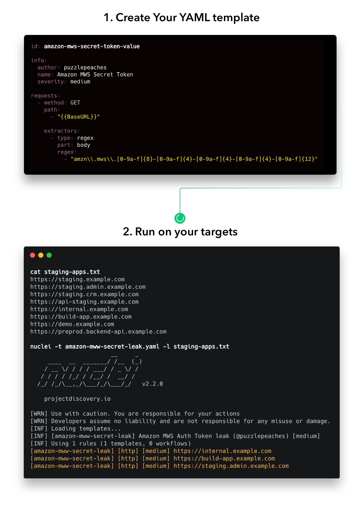

# What is Nuclei?

Nuclei is a fast and customizable vulnerability scanner based on simple YAML based DSL designed for modern attack surface vulnerability scanning. 

Nuclei is used to send requests across targets based on a template, leading to zero false positives and providing fast scanning on a large number of hosts. Nuclei offers scanning for a variety of protocols, including TCP, DNS, HTTP, SSL, File, Whois, Websocket, Headless etc. With powerful and flexible templating, Nuclei can be used to model all kinds of security checks.

**Key features**

- Community Powered
- YAML DSL
- Fast
- Integrations
- Simple Language for vulnerabilities.

i. **How does Nuclei Works?**

Nuclei provides a DSL engine for security checks written in YAML language, which are then executed at scale on user Assets. Templates can be written by users and are very flexible, containing features to aid users in accomplish their task of testing an exploit / issue on a target.

Nuclei engine comes with a public repository of security checks called [nuclei-templates](https://github.com/projectdiscovery/nuclei-temlates) which contains more then 3500+ security checks contributed by the community.

The core workflow of Nuclei consists of two main steps.

a. **Write** - Write your security check in YAML format in any editor of your choice. The created file is validated by nuclei at runtime so you can be sure of the correctness of the template. 

b. **Execute** - Execute the written check across all your Assets, whether from Blue Team or Red Team.

ii. **What are templates and Workflows?**

Template is a YAML File which defines the security checks to be performed. A template follows the structure defined in the [Sytax Reference](../references/yaml-syntax.md") // todo: fix reference // file. 

Workflows define a list of templates to be chained together and executed in a specific manner. Conditions can be created for things like tags, matcher-names, etc from template.